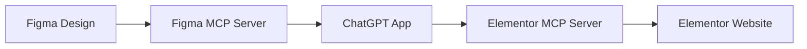

<a href="https://www.framelink.ai/?utm_source=github&utm_medium=referral&utm_campaign=readme" target="_blank" rel="noopener">
  <picture>
    <source media="(prefers-color-scheme: dark)" srcset="https://www.framelink.ai/github/HeaderDark.png" />
    
  </picture>
</a>

<div align="center">
  <h1>Framelink Figma MCP Server</h1>
  <p>
    🌐 Available in:
    <a href="README.ko.md">한국어 (Korean)</a> |
    <a href="README.ja.md">日本語 (Japanese)</a> |
    <a href="README.zh.md">中文 (Chinese)</a>
  </p>
  <h3>Give your coding agent access to your Figma data.<br/>Implement designs in any framework in one-shot.</h3>
  <a href="https://npmcharts.com/compare/figma-developer-mcp?interval=30">
    
  </a>
  <a href="https://github.com/GLips/Figma-Context-MCP/blob/main/LICENSE">
    
  </a>
  <a href="https://framelink.ai/discord">
    
  </a>
  <br />
  <a href="https://twitter.com/glipsman">
    
  </a>
</div>

<br/>

Give [Cursor](https://cursor.sh/) and other AI-powered coding tools access to your Figma files with this [Model Context Protocol](https://modelcontextprotocol.io/introduction) server.

When Cursor has access to Figma design data, it's **way** better at one-shotting designs accurately than alternative approaches like pasting screenshots.

<h3><a href="https://www.framelink.ai/docs/quickstart?utm_source=github&utm_medium=referral&utm_campaign=readme">See quickstart instructions →</a></h3>

## Demo

[Watch a demo of building a UI in Cursor with Figma design data](https://youtu.be/6G9yb-LrEqg)

[](https://youtu.be/6G9yb-LrEqg)

## How it works

1. Open your IDE's chat (e.g. agent mode in Cursor).
2. Paste a link to a Figma file, frame, or group.
3. Ask Cursor to do something with the Figma file—e.g. implement the design.
4. Cursor will fetch the relevant metadata from Figma and use it to write your code.

This MCP server is specifically designed for use with Cursor. Before responding with context from the [Figma API](https://www.figma.com/developers/api), it simplifies and translates the response so only the most relevant layout and styling information is provided to the model.

Reducing the amount of context provided to the model helps make the AI more accurate and the responses more relevant.

## Production Deployment

This MCP server is now **production-ready** and can be deployed to cloud platforms like Render.com, Heroku, or any Node.js hosting service.

**🚀 Live Deployment**: This server is currently deployed at: **https://figma-context-mcp-fre3.onrender.com**

### ✅ Deployment Features

- **Health Check Endpoints**: `/health` for monitoring
- **REST API**: Status and configuration endpoints
- **CORS Support**: Pre-configured for Cursor IDE and local development
- **Environment Configuration**: Production-ready environment variable handling
- **Docker Support**: Containerized deployment option
- **Comprehensive Logging**: Production logging and error handling

### Quick Deploy to Render.com

1. **Fork this repository**
2. **Connect to Render.com**
3. **Set environment variables**:
   - `FIGMA_API_KEY`: Your Figma Personal Access Token
   - `NODE_ENV`: `production`
4. **Deploy with these settings**:
   - Build Command: `pnpm install && pnpm build`
   - Start Command: `pnpm start:http`
   - Health Check Path: `/health`

See [DEPLOYMENT.md](DEPLOYMENT.md) for detailed deployment instructions.

### Available Endpoints

| Endpoint | Method | Purpose |
|----------|--------|---------|
| `/health` | GET | Health check for monitoring |
| `/api/status` | GET | Service status and version info |
| `/api/config` | GET | Configuration details |
| `/api/debug-figma` | GET | Figma API debugging |
| `/mcp` | POST | MCP StreamableHTTP endpoint |
| `/sse` | GET | Server-Sent Events endpoint |
| `/messages` | POST | SSE message handling |

**Test the live deployment:**
- Health Check: https://figma-context-mcp-fre3.onrender.com/health
- Status: https://figma-context-mcp-fre3.onrender.com/api/status
- Debug: https://figma-context-mcp-fre3.onrender.com/api/debug-figma

### Testing the Deployed MCP Server

You can test the deployed server directly using curl or any HTTP client:

```bash
# Health check
curl https://figma-context-mcp-fre3.onrender.com/health

# Service status
curl https://figma-context-mcp-fre3.onrender.com/api/status

# MCP endpoint (requires proper JSON-RPC 2.0 format)
curl -X POST https://figma-context-mcp-fre3.onrender.com/mcp \
  -H "Content-Type: application/json" \
  -d '{
    "jsonrpc": "2.0",
    "method": "tools/call",
    "params": {
      "name": "get_figma_data",
      "arguments": {"fileKey": "your-figma-file-key"}
    },
    "id": 1
  }'
```

## ChatGPT Integration for Figma to Elementor Workflow

This MCP server can be integrated into a ChatGPT application to create a powerful Figma-to-Elementor conversion workflow.

### Workflow Overview



### ChatGPT App Architecture

#### 1. **Frontend (React/Next.js)**
```javascript
// Example ChatGPT app integration
const FigmaToElementorApp = () => {
  const [figmaUrl, setFigmaUrl] = useState('');
  const [elementorSite, setElementorSite] = useState('');
  
  const convertDesign = async () => {
    // Step 1: Load Figma data via MCP
    const figmaData = await fetch('/api/figma-mcp', {
      method: 'POST',
      headers: { 'Content-Type': 'application/json' },
      body: JSON.stringify({
        jsonrpc: '2.0',
        method: 'tools/call',
        params: {
          name: 'get_figma_data',
          arguments: { fileKey: extractFileKey(figmaUrl) }
        }
      })
    });
    
    // Step 2: Process with ChatGPT
    const elementorCode = await processWithChatGPT(figmaData);
    
    // Step 3: Deploy to Elementor via second MCP
    await deployToElementor(elementorCode, elementorSite);
  };
};
```

#### 2. **Backend API Routes**

**`/api/figma-mcp`** - Proxy to Figma MCP Server
```javascript
export default async function handler(req, res) {
  const response = await fetch(`${process.env.FIGMA_MCP_URL}/mcp`, {
    method: 'POST',
    headers: { 'Content-Type': 'application/json' },
    body: JSON.stringify(req.body)
  });
  
  const data = await response.json();
  res.json(data);
}
```

**`/api/chatgpt-process`** - ChatGPT Processing
```javascript
export default async function handler(req, res) {
  const { figmaData } = req.body;
  
  const completion = await openai.chat.completions.create({
    model: "gpt-4",
    messages: [
      {
        role: "system",
        content: "Convert Figma design data to Elementor widget configuration..."
      },
      {
        role: "user",
        content: `Convert this Figma data to Elementor: ${JSON.stringify(figmaData)}`
      }
    ]
  });
  
  res.json({ elementorConfig: completion.choices[0].message.content });
}
```

**`/api/elementor-deploy`** - Elementor MCP Integration
```javascript
export default async function handler(req, res) {
  const { elementorConfig, siteUrl } = req.body;
  
  // Deploy to Elementor via second MCP server
  const response = await fetch(`${process.env.ELEMENTOR_MCP_URL}/deploy`, {
    method: 'POST',
    headers: { 'Content-Type': 'application/json' },
    body: JSON.stringify({
      config: elementorConfig,
      site: siteUrl
    })
  });
  
  res.json(await response.json());
}
```

#### 3. **Environment Variables for ChatGPT App**

```env
# Figma MCP Server (deployed server)
FIGMA_MCP_URL=https://figma-context-mcp-fre3.onrender.com

# Elementor MCP Server (to be built)
ELEMENTOR_MCP_URL=https://your-elementor-mcp.onrender.com

# OpenAI API
OPENAI_API_KEY=your_openai_api_key

# Elementor API (if direct integration)
ELEMENTOR_API_KEY=your_elementor_api_key
ELEMENTOR_SITE_URL=https://your-elementor-site.com
```

#### 4. **MCP Communication Format**

**Figma Data Request:**
```json
{
  "jsonrpc": "2.0",
  "method": "tools/call",
  "params": {
    "name": "get_figma_data",
    "arguments": {
      "fileKey": "z8nv6p3cbJCgTp7hbHXGil",
      "nodeId": "1234:5678"
    }
  },
  "id": 1
}
```

**Expected Response:**
```json
{
  "jsonrpc": "2.0",
  "result": {
    "content": [
      {
        "type": "text",
        "text": "Figma design data with layout, colors, typography..."
      }
    ]
  },
  "id": 1
}
```

#### 5. **ChatGPT Prompt Engineering**

```javascript
const FIGMA_TO_ELEMENTOR_PROMPT = `
You are an expert at converting Figma designs to Elementor widgets.

Given Figma design data, create Elementor widget configurations that:
1. Preserve the visual layout and styling
2. Use appropriate Elementor widgets (heading, text, image, button, etc.)
3. Maintain responsive design principles
4. Include proper spacing and typography
5. Generate clean, semantic HTML structure

Input: Figma design data (JSON)
Output: Elementor widget configuration (JSON)

Example output format:
{
  "widgets": [
    {
      "type": "heading",
      "settings": {
        "title": "Design Title",
        "size": "h1",
        "color": "#333333"
      }
    }
  ]
}
`;
```

### Deployment Findings & Issues

#### ✅ Successfully Deployed Features
- MCP server deployed and running on Render.com
- Health check endpoints working (`/health`, `/api/status`)
- CORS configured for ChatGPT app integration
- Environment variables properly configured
- SSE and StreamableHTTP transports both functional

#### ⚠️ Known Issues
1. **Figma File Access**: Some files return "400 Bad Request" or "404 Not Found"
   - **Cause**: Private files, incorrect file IDs, or access permissions
   - **Solution**: Ensure files are public or use proper OAuth tokens

2. **File ID Format**: Must use correct Figma file key format
   - **Correct**: `z8nv6p3cbJCgTp7hbHXGil` (from URL)
   - **Incorrect**: Full URLs or node IDs

#### 🔧 Troubleshooting
- Use `/api/debug-figma` endpoint to test Figma API connectivity
- Check Render.com logs for detailed error messages
- Verify FIGMA_API_KEY is properly set (45 characters, starts with "figd_")

### Next Steps for ChatGPT App

1. **Create React/Next.js frontend** with Figma URL input
2. **Implement ChatGPT processing** for design conversion
3. **Build Elementor MCP server** for widget deployment
4. **Add authentication** for Elementor site access
5. **Implement preview functionality** before deployment
6. **Add error handling** for failed conversions

## Getting Started

Many code editors and other AI clients use a configuration file to manage MCP servers.

The `figma-developer-mcp` server can be configured by adding the following to your configuration file.

> NOTE: You will need to create a Figma access token to use this server. Instructions on how to create a Figma API access token can be found [here](https://help.figma.com/hc/en-us/articles/8085703771159-Manage-personal-access-tokens).

### MacOS / Linux

```json
{
  "mcpServers": {
    "Framelink Figma MCP": {
      "command": "npx",
      "args": ["-y", "figma-developer-mcp", "--figma-api-key=YOUR-KEY", "--stdio"]
    }
  }
}
```

### Windows

```json
{
  "mcpServers": {
    "Framelink Figma MCP": {
      "command": "cmd",
      "args": ["/c", "npx", "-y", "figma-developer-mcp", "--figma-api-key=YOUR-KEY", "--stdio"]
    }
  }
}
```

Or you can set `FIGMA_API_KEY` and `PORT` in the `env` field.

If you need more information on how to configure the Framelink Figma MCP server, see the [Framelink docs](https://www.framelink.ai/docs/quickstart?utm_source=github&utm_medium=referral&utm_campaign=readme).

## Star History

<a href="https://star-history.com/#GLips/Figma-Context-MCP"></a>

## Learn More

The Framelink Figma MCP server is simple but powerful. Get the most out of it by the [Framelink](https://framelink.ai?utm_source=github&utm_medium=referral&utm_campaign=readme) site.

<!-- SPONSORS:LIST:START -->
<!-- prettier-ignore-start -->
<!-- markdownlint-disable -->

## Sponsors

### 🥇 Gold Sponsors

<table>
  <tr>
   <td align="center"><a href="https://framelink.ai/?ref=framelink-mcp&utm_source=github&utm_medium=referral&utm_campaign=framelink-mcp"><br />Framelink</a></td>
  </tr>
</table>

### 🥈 Silver Sponsors

<table>
  <tr>
   <!-- <td align="center"><a href=""><br />Title</a></td> -->
  </tr>
</table>

### 🥉 Bronze Sponsors

<table>
  <tr>
   <!-- <td align="center"><a href=""><br />tbd</a></td>-->
  </tr>
</table>

### 😻 Smaller Backers

<table>
  <tr>
   <!-- <td align="center"><a href=""><br />tbd</a></td>-->
  </tr>
  <tr>
   <!-- <td align="center"><a href=""><br />tbd</a></td>-->
  </tr>
</table>

<!-- markdownlint-restore -->
<!-- prettier-ignore-end -->

<!-- SPONSORS:LIST:END -->
