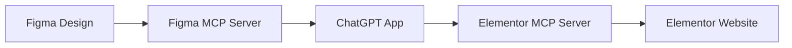

<a href="https://www.framelink.ai/?utm_source=github&utm_medium=referral&utm_campaign=readme" target="_blank" rel="noopener">
  <picture>
    <source media="(prefers-color-scheme: dark)" srcset="https://www.framelink.ai/github/HeaderDark.png" />
    
  </picture>
</a>

<div align="center">
  <h1>Framelink Figma MCP Server</h1>
  <p>
    🌐 Available in:
    <a href="README.ko.md">한국어 (Korean)</a> |
    <a href="README.ja.md">日本語 (Japanese)</a> |
    <a href="README.zh.md">中文 (Chinese)</a>
  </p>
  <h3>Give your coding agent access to your Figma data.<br/>Implement designs in any framework in one-shot.</h3>
  <a href="https://npmcharts.com/compare/figma-developer-mcp?interval=30">
    
  </a>
  <a href="https://github.com/GLips/Figma-Context-MCP/blob/main/LICENSE">
    
  </a>
  <a href="https://framelink.ai/discord">
    
  </a>
  <br />
  <a href="https://twitter.com/glipsman">
    
  </a>
</div>

<br/>

Give [Cursor](https://cursor.sh/) and other AI-powered coding tools access to your Figma files with this [Model Context Protocol](https://modelcontextprotocol.io/introduction) server.

When Cursor has access to Figma design data, it's **way** better at one-shotting designs accurately than alternative approaches like pasting screenshots.

<h3><a href="https://www.framelink.ai/docs/quickstart?utm_source=github&utm_medium=referral&utm_campaign=readme">See quickstart instructions →</a></h3>

## Demo

[Watch a demo of building a UI in Cursor with Figma design data](https://youtu.be/6G9yb-LrEqg)

[](https://youtu.be/6G9yb-LrEqg)

## How it works

1. Open your IDE's chat (e.g. agent mode in Cursor).
2. Paste a link to a Figma file, frame, or group.
3. Ask Cursor to do something with the Figma file—e.g. implement the design.
4. Cursor will fetch the relevant metadata from Figma and use it to write your code.

This MCP server is specifically designed for use with Cursor. Before responding with context from the [Figma API](https://www.figma.com/developers/api), it simplifies and translates the response so only the most relevant layout and styling information is provided to the model.

Reducing the amount of context provided to the model helps make the AI more accurate and the responses more relevant.

## Production Deployment

This MCP server is now **production-ready** and can be deployed to cloud platforms like Render.com, Heroku, or any Node.js hosting service.

**🚀 Live Deployment**: This server is currently deployed at: **https://figma-context-mcp-fre3.onrender.com**

### ✅ Deployment Features

- **Health Check Endpoints**: `/health` for monitoring
- **REST API**: Status and configuration endpoints
- **CORS Support**: Pre-configured for Cursor IDE and local development
- **Environment Configuration**: Production-ready environment variable handling
- **Docker Support**: Containerized deployment option
- **Comprehensive Logging**: Production logging and error handling

### Quick Deploy to Render.com

1. **Fork this repository**
2. **Connect to Render.com**
3. **Set environment variables**:
   - `FIGMA_API_KEY`: Your Figma Personal Access Token
   - `NODE_ENV`: `production`
4. **Deploy with these settings**:
   - Build Command: `pnpm install && pnpm build`
   - Start Command: `pnpm start:http`
   - Health Check Path: `/health`

See [DEPLOYMENT.md](DEPLOYMENT.md) for detailed deployment instructions.

### Available Endpoints

| Endpoint | Method | Purpose |
|----------|--------|---------|
| `/health` | GET | Health check for monitoring |
| `/api/status` | GET | Service status and version info |
| `/api/config` | GET | Configuration details |
| `/api/debug-figma` | GET | Figma API debugging |
| `/mcp` | POST | MCP StreamableHTTP endpoint |
| `/sse` | GET | Server-Sent Events endpoint |
| `/messages` | POST | SSE message handling |

**Test the live deployment:**
- Health Check: https://figma-context-mcp-fre3.onrender.com/health
- Status: https://figma-context-mcp-fre3.onrender.com/api/status
- Debug: https://figma-context-mcp-fre3.onrender.com/api/debug-figma

### Testing the Deployed MCP Server

You can test the deployed server directly using curl or any HTTP client:

```bash
# Health check
curl https://figma-context-mcp-fre3.onrender.com/health

# Service status
curl https://figma-context-mcp-fre3.onrender.com/api/status

# MCP endpoint (requires proper JSON-RPC 2.0 format)
curl -X POST https://figma-context-mcp-fre3.onrender.com/mcp \
  -H "Content-Type: application/json" \
  -d '{
    "jsonrpc": "2.0",
    "method": "tools/call",
    "params": {
      "name": "get_figma_data",
      "arguments": {"fileKey": "your-figma-file-key"}
    },
    "id": 1
  }'
```

## Server-Sent Events (SSE) Integration

The deployed MCP server supports both **StreamableHTTP** (`/mcp`) and **Server-Sent Events** (`/sse`) transport methods for real-time communication.

**🔐 Session Management**: The deployed server requires proper session management for both transport methods. This is handled automatically by the integration code below.

### SSE Endpoints

| Endpoint | Method | Purpose |
|----------|--------|---------|
| `/sse` | GET | Establish SSE connection (creates session automatically) |
| `/messages?sessionId=<id>` | POST | Send MCP messages via SSE using session ID |

### Session Management Flow

#### SSE Transport (Recommended)
1. **GET `/sse`**: Automatically creates session and returns session ID
2. **Extract Session ID**: Parse session ID from SSE response
3. **POST `/messages?sessionId=<id>`**: Send MCP requests using the session

#### StreamableHTTP Transport (Fallback)
1. **POST `/mcp`** with `initialize` request: Creates new session
2. **Extract Session ID**: Get session ID from `mcp-session-id` header  
3. **POST `/mcp`** with `mcp-session-id` header: Send subsequent requests

### SSE Usage Example with Session Management

```javascript
// Complete SSE integration with session management
async function fetchFromDeployedMCP(fileKey, nodeId) {
  const mcpPayload = {
    jsonrpc: '2.0',
    method: 'tools/call',
    params: {
      name: 'get_figma_data',
      arguments: { fileKey, ...(nodeId && { nodeId }) }
    },
    id: Date.now(),
  };

  try {
    // Step 1: Establish SSE connection (creates session automatically)
    const sseResponse = await fetch('https://figma-context-mcp-fre3.onrender.com/sse', {
      method: 'GET',
      headers: {
        'Accept': 'text/event-stream',
        'Cache-Control': 'no-cache',
        'Connection': 'keep-alive',
        'User-Agent': 'your-app/1.0',
      },
    });

    if (!sseResponse.ok) {
      throw new Error(`SSE connection failed: ${sseResponse.status}`);
    }

    // Step 2: Extract session ID from SSE response
    const responseText = await sseResponse.text();
    const sessionIdMatch = responseText.match(/data: {"sessionId":"([^"]+)"/);
    
    if (!sessionIdMatch) {
      throw new Error('Could not extract session ID from SSE response');
    }
    
    const sessionId = sessionIdMatch[1];

    // Step 3: Send MCP message using the session ID
    const messageResponse = await fetch(`https://figma-context-mcp-fre3.onrender.com/messages?sessionId=${sessionId}`, {
      method: 'POST',
      headers: {
        'Content-Type': 'application/json',
        'Accept': 'application/json',
        'User-Agent': 'your-app/1.0',
      },
      body: JSON.stringify(mcpPayload),
    });

    if (!messageResponse.ok) {
      throw new Error(`SSE message failed: ${messageResponse.status}`);
    }

    const result = await messageResponse.json();
    
    if (result.error) {
      throw new Error(`Figma-Context-MCP error: ${result.error.message}`);
    }

    return result.result || result;

  } catch (error) {
    console.warn('SSE method failed, falling back to StreamableHTTP:', error);
    return await fetchViaHTTP(fileKey, nodeId);
  }
}
```

### CORS Configuration

The server is pre-configured with CORS support for:

- **Local Development**: `localhost:3000`, `localhost:3001`, `localhost:8080`
- **Cursor IDE**: `https://cursor.sh`, `https://www.cursor.sh`
- **Custom Origins**: Add your domain to the allowedOrigins array

#### Adding Custom CORS Origins

To add your application's domain, modify `src/server.ts`:

```typescript
const allowedOrigins = [
  'http://localhost:3000',
  'http://localhost:3001', 
  'http://localhost:8080',
  'https://cursor.sh',
  'https://www.cursor.sh',
  'https://your-app-domain.com',  // Add your domain here
];
```

### Transport Method Selection

**Recommended Approach**: Use SSE with HTTP fallback for maximum reliability:

```javascript
async function fetchFromFigmaMCP(fileKey, nodeId) {
  try {
    // Try SSE first (real-time, efficient)
    return await fetchViaSSE(fileKey, nodeId);
  } catch (error) {
    console.warn('SSE failed, falling back to HTTP');
    // Fallback to StreamableHTTP (reliable, standard)
    return await fetchViaHTTP(fileKey, nodeId);
  }
}

async function fetchViaSSE(fileKey, nodeId) {
  // Establish SSE connection
  const sseResponse = await fetch('https://figma-context-mcp-fre3.onrender.com/sse', {
    method: 'GET',
    headers: {
      'Accept': 'text/event-stream',
      'Cache-Control': 'no-cache',
      'Connection': 'keep-alive',
    },
  });

  if (!sseResponse.ok) {
    throw new Error(`SSE connection failed: ${sseResponse.status}`);
  }

  // Send message via SSE
  const mcpPayload = {
    jsonrpc: '2.0',
    method: 'tools/call',
    params: {
      name: 'get_figma_data',
      arguments: { fileKey, ...(nodeId && { nodeId }) },
    },
    id: Date.now(),
  };

  const messageResponse = await fetch('https://figma-context-mcp-fre3.onrender.com/messages', {
    method: 'POST',
    headers: {
      'Content-Type': 'application/json',
      'Accept': 'application/json',
    },
    body: JSON.stringify(mcpPayload),
  });

  if (!messageResponse.ok) {
    throw new Error(`SSE message failed: ${messageResponse.status}`);
  }

  return await messageResponse.json();
}

async function fetchViaHTTP(fileKey, nodeId) {
  // Step 1: Initialize session with deployed server
  const initPayload = {
    jsonrpc: '2.0',
    method: 'initialize',
    params: {
      protocolVersion: '2024-11-05',
      capabilities: {},
      clientInfo: {
        name: 'your-app',
        version: '1.0.0',
      },
    },
    id: 1,
  };

  const initResponse = await fetch('https://figma-context-mcp-fre3.onrender.com/mcp', {
    method: 'POST',
    headers: {
      'Content-Type': 'application/json',
      'Accept': 'application/json',
      'User-Agent': 'your-app/1.0',
      'Origin': 'https://your-app.com',
    },
    body: JSON.stringify(initPayload),
  });

  if (!initResponse.ok) {
    throw new Error(`Failed to initialize session: ${initResponse.status}`);
  }

  // Step 2: Extract session ID from response headers
  const sessionId = initResponse.headers.get('mcp-session-id');
  if (!sessionId) {
    throw new Error('No session ID received from initialization');
  }

  // Step 3: Make the actual request with session ID
  const mcpPayload = {
    jsonrpc: '2.0',
    method: 'tools/call',
    params: {
      name: 'get_figma_data',
      arguments: { fileKey, ...(nodeId && { nodeId }) },
    },
    id: Date.now(),
  };

  const response = await fetch('https://figma-context-mcp-fre3.onrender.com/mcp', {
    method: 'POST',
    headers: {
      'Content-Type': 'application/json',
      'Accept': 'application/json',
      'User-Agent': 'your-app/1.0',
      'mcp-session-id': sessionId,
      'Origin': 'https://your-app.com',
    },
    body: JSON.stringify(mcpPayload),
  });

  if (!response.ok) {
    throw new Error(`HTTP request failed: ${response.status}`);
  }

  const data = await response.json();
  
  if (data.error) {
    throw new Error(`Figma-Context-MCP error: ${data.error.message}`);
  }

  return data.result || data;
}
```

### Authentication & Headers

**Required Headers for External Integration**:

```javascript
const headers = {
  'Content-Type': 'application/json',
  'Accept': 'application/json',
  'User-Agent': 'your-app-name/version',
  'Origin': 'https://your-domain.com',  // Important for CORS
};
```

**For SSE connections**:

```javascript
const sseHeaders = {
  'Accept': 'text/event-stream',
  'Cache-Control': 'no-cache',
  'Connection': 'keep-alive',
  'User-Agent': 'your-app-name/version',
};
```

## ChatGPT Integration for Figma to Elementor Workflow

This MCP server can be integrated into a ChatGPT application to create a powerful Figma-to-Elementor conversion workflow.

### Workflow Overview



### ChatGPT App Architecture

#### 1. **Frontend (React/Next.js)**
```javascript
// Example ChatGPT app integration
const FigmaToElementorApp = () => {
  const [figmaUrl, setFigmaUrl] = useState('');
  const [elementorSite, setElementorSite] = useState('');
  
  const convertDesign = async () => {
    // Step 1: Load Figma data via MCP
    const figmaData = await fetch('/api/figma-mcp', {
      method: 'POST',
      headers: { 'Content-Type': 'application/json' },
      body: JSON.stringify({
        jsonrpc: '2.0',
        method: 'tools/call',
        params: {
          name: 'get_figma_data',
          arguments: { fileKey: extractFileKey(figmaUrl) }
        }
      })
    });
    
    // Step 2: Process with ChatGPT
    const elementorCode = await processWithChatGPT(figmaData);
    
    // Step 3: Deploy to Elementor via second MCP
    await deployToElementor(elementorCode, elementorSite);
  };
};
```

#### 2. **Backend API Routes**

**`/api/figma-mcp`** - Proxy to Figma MCP Server (SSE with HTTP fallback)
```javascript
export default async function handler(req, res) {
  try {
    // Try SSE first with session management
    const sseResponse = await fetch('https://figma-context-mcp-fre3.onrender.com/sse', {
      method: 'GET',
      headers: {
        'Accept': 'text/event-stream',
        'Cache-Control': 'no-cache',
        'Connection': 'keep-alive',
        'User-Agent': 'chatgpt-figma-app/1.0',
      },
    });

    if (sseResponse.ok) {
      // Extract session ID from SSE response
      const responseText = await sseResponse.text();
      const sessionIdMatch = responseText.match(/data: {"sessionId":"([^"]+)"/);
      
      if (sessionIdMatch) {
        const sessionId = sessionIdMatch[1];
        
        // Send via SSE with session ID
        const messageResponse = await fetch(`https://figma-context-mcp-fre3.onrender.com/messages?sessionId=${sessionId}`, {
          method: 'POST',
          headers: {
            'Content-Type': 'application/json',
            'Accept': 'application/json',
            'User-Agent': 'chatgpt-figma-app/1.0',
          },
          body: JSON.stringify(req.body),
        });
        
        if (messageResponse.ok) {
          const data = await messageResponse.json();
          return res.json(data);
        }
      }
    }
  } catch (error) {
    console.warn('SSE failed, falling back to HTTP:', error);
  }

  // Fallback to StreamableHTTP with session management
  try {
    // Initialize session
    const initPayload = {
      jsonrpc: '2.0',
      method: 'initialize',
      params: {
        protocolVersion: '2024-11-05',
        capabilities: {},
        clientInfo: { name: 'chatgpt-figma-app', version: '1.0.0' },
      },
      id: 1,
    };

    const initResponse = await fetch('https://figma-context-mcp-fre3.onrender.com/mcp', {
      method: 'POST',
      headers: {
        'Content-Type': 'application/json',
        'Accept': 'application/json',
        'Origin': process.env.NEXTAUTH_URL || 'http://localhost:3000',
      },
      body: JSON.stringify(initPayload),
    });

    const sessionId = initResponse.headers.get('mcp-session-id');
    
    if (sessionId) {
      // Make request with session ID
      const response = await fetch('https://figma-context-mcp-fre3.onrender.com/mcp', {
        method: 'POST',
        headers: {
          'Content-Type': 'application/json',
          'Accept': 'application/json',
          'mcp-session-id': sessionId,
          'Origin': process.env.NEXTAUTH_URL || 'http://localhost:3000',
        },
        body: JSON.stringify(req.body),
      });
      
      const data = await response.json();
      return res.json(data);
    }
  } catch (error) {
    console.error('HTTP fallback failed:', error);
  }

  res.status(500).json({ error: 'Failed to connect to Figma MCP server' });
}
```

**`/api/chatgpt-process`** - ChatGPT Processing
```javascript
export default async function handler(req, res) {
  const { figmaData } = req.body;
  
  const completion = await openai.chat.completions.create({
    model: "gpt-4",
    messages: [
      {
        role: "system",
        content: "Convert Figma design data to Elementor widget configuration..."
      },
      {
        role: "user",
        content: `Convert this Figma data to Elementor: ${JSON.stringify(figmaData)}`
      }
    ]
  });
  
  res.json({ elementorConfig: completion.choices[0].message.content });
}
```

**`/api/elementor-deploy`** - Elementor MCP Integration
```javascript
export default async function handler(req, res) {
  const { elementorConfig, siteUrl } = req.body;
  
  // Deploy to Elementor via second MCP server
  const response = await fetch(`${process.env.ELEMENTOR_MCP_URL}/deploy`, {
    method: 'POST',
    headers: { 'Content-Type': 'application/json' },
    body: JSON.stringify({
      config: elementorConfig,
      site: siteUrl
    })
  });
  
  res.json(await response.json());
}
```

#### 3. **Environment Variables for ChatGPT App**

```env
# Figma MCP Server (deployed server)
FIGMA_MCP_URL=https://figma-context-mcp-fre3.onrender.com

# Elementor MCP Server (to be built)
ELEMENTOR_MCP_URL=https://your-elementor-mcp.onrender.com

# OpenAI API
OPENAI_API_KEY=your_openai_api_key

# Elementor API (if direct integration)
ELEMENTOR_API_KEY=your_elementor_api_key
ELEMENTOR_SITE_URL=https://your-elementor-site.com
```

#### 4. **MCP Communication Format**

**Figma Data Request:**
```json
{
  "jsonrpc": "2.0",
  "method": "tools/call",
  "params": {
    "name": "get_figma_data",
    "arguments": {
      "fileKey": "z8nv6p3cbJCgTp7hbHXGil",
      "nodeId": "1234:5678"
    }
  },
  "id": 1
}
```

**Expected Response:**
```json
{
  "jsonrpc": "2.0",
  "result": {
    "content": [
      {
        "type": "text",
        "text": "Figma design data with layout, colors, typography..."
      }
    ]
  },
  "id": 1
}
```

#### 5. **ChatGPT Prompt Engineering**

```javascript
const FIGMA_TO_ELEMENTOR_PROMPT = `
You are an expert at converting Figma designs to Elementor widgets.

Given Figma design data, create Elementor widget configurations that:
1. Preserve the visual layout and styling
2. Use appropriate Elementor widgets (heading, text, image, button, etc.)
3. Maintain responsive design principles
4. Include proper spacing and typography
5. Generate clean, semantic HTML structure

Input: Figma design data (JSON)
Output: Elementor widget configuration (JSON)

Example output format:
{
  "widgets": [
    {
      "type": "heading",
      "settings": {
        "title": "Design Title",
        "size": "h1",
        "color": "#333333"
      }
    }
  ]
}
`;
```

### Deployment Findings & Issues

#### ✅ Successfully Deployed Features
- MCP server deployed and running on Render.com
- Health check endpoints working (`/health`, `/api/status`)
- CORS configured for ChatGPT app integration
- Environment variables properly configured
- SSE and StreamableHTTP transports both functional

#### ⚠️ Known Issues
1. **Figma File Access**: Some files return "400 Bad Request" or "404 Not Found"
   - **Cause**: Private files, incorrect file IDs, or access permissions
   - **Solution**: Ensure files are public or use proper OAuth tokens

2. **File ID Format**: Must use correct Figma file key format
   - **Correct**: `z8nv6p3cbJCgTp7hbHXGil` (from URL)
   - **Incorrect**: Full URLs or node IDs

#### 🔧 Troubleshooting
- Use `/api/debug-figma` endpoint to test Figma API connectivity
- Check Render.com logs for detailed error messages
- Verify FIGMA_API_KEY is properly set (45 characters, starts with "figd_")

### SSE Integration Troubleshooting

#### Common SSE Issues & Solutions

**1. CORS Errors**
```
Access to fetch at 'https://figma-context-mcp-fre3.onrender.com/sse' from origin 'https://your-app.com' has been blocked by CORS policy
```
**Solution**: Add your domain to the CORS allowedOrigins in `src/server.ts`:
```typescript
const allowedOrigins = [
  // ... existing origins
  'https://your-app.com',
];
```

**2. SSE Connection Fails**
```
SSE connection failed: 404 Not Found
```
**Solution**: Ensure you're using the correct SSE endpoint:
- ✅ Correct: `https://figma-context-mcp-fre3.onrender.com/sse`
- ❌ Wrong: `https://figma-context-mcp-fre3.onrender.com/mcp`

**3. Authentication Issues**
```
Error: Failed to fetch from Figma-Context-MCP: 401 Unauthorized
```
**Solution**: The deployed server handles Figma API authentication internally. Ensure:
- The server's `FIGMA_API_KEY` environment variable is set
- Your requests include proper headers:
```javascript
headers: {
  'User-Agent': 'your-app/1.0',
  'Origin': 'https://your-domain.com',
}
```

**4. Session Management Issues**
```
Error: Bad Request: No valid session ID provided
```
**Solution**: The deployed server requires session management. Ensure you:
- Initialize sessions properly for StreamableHTTP transport
- Extract session IDs from SSE connections
- Include session IDs in subsequent requests

**For SSE**: Extract session ID from response text:
```javascript
const responseText = await sseResponse.text();
const sessionIdMatch = responseText.match(/data: {"sessionId":"([^"]+)"/);
const sessionId = sessionIdMatch[1];
```

**For StreamableHTTP**: Initialize session first:
```javascript
// Send initialize request
const initResponse = await fetch('/mcp', { /* initialize payload */ });
const sessionId = initResponse.headers.get('mcp-session-id');

// Use session ID in subsequent requests
headers: { 'mcp-session-id': sessionId }
```

**5. Message Format Errors**
```
Error: Invalid JSON-RPC 2.0 format
```
**Solution**: Ensure your MCP payload follows the correct format:
```javascript
const mcpPayload = {
  jsonrpc: '2.0',                    // Required
  method: 'tools/call',              // Required
  params: {                          // Required
    name: 'get_figma_data',
    arguments: { fileKey: 'abc123' }
  },
  id: Date.now(),                    // Required, must be unique
};
```

**6. Figma File Access Issues**
```
Error: 400 Bad Request - File not found
```
**Solution**: 
- Ensure the Figma file is public or accessible with the server's API key
- Verify the file key format: `z8nv6p3cbJCgTp7hbHXGil` (not the full URL)
- Test with the debug endpoint: `https://figma-context-mcp-fre3.onrender.com/api/debug-figma`

#### Testing SSE Connection

```bash
# Test SSE endpoint
curl -N -H "Accept: text/event-stream" \
  https://figma-context-mcp-fre3.onrender.com/sse

# Test message sending
curl -X POST https://figma-context-mcp-fre3.onrender.com/messages \
  -H "Content-Type: application/json" \
  -d '{
    "jsonrpc": "2.0",
    "method": "tools/call",
    "params": {
      "name": "get_figma_data",
      "arguments": {"fileKey": "test-file-key"}
    },
    "id": 1
  }'
```

#### External MCP Server Integration

If you're building an external MCP server that connects to this deployed server:

**1. Use the SSE Transport Pattern**:
```typescript
// In your external MCP server
async function fetchFromDeployedMCP(fileKey: string) {
  try {
    // Try SSE first
    return await fetchViaSSE(fileKey);
  } catch (error) {
    // Fallback to HTTP
    return await fetchViaHTTP(fileKey);
  }
}
```

**2. Handle CORS Properly**:
```typescript
const headers = {
  'Content-Type': 'application/json',
  'Accept': 'application/json',
  'User-Agent': 'your-mcp-server/1.0',
  'Origin': 'https://your-server-domain.com',
};
```

**3. Implement Proper Error Handling**:
```typescript
if (data.error) {
  throw new Error(`Figma-Context-MCP error: ${data.error.message || JSON.stringify(data.error)}`);
}

return data.result || data;
```

#### Performance Optimization

**For High-Volume Usage**:
- Use SSE for real-time applications (ChatGPT, live editors)
- Use HTTP for batch processing or simple integrations
- Implement request caching for frequently accessed files
- Add retry logic with exponential backoff

**Rate Limiting Considerations**:
- The server respects Figma API rate limits
- Implement client-side throttling for multiple requests
- Cache responses when possible to reduce API calls

### Next Steps for ChatGPT App Development

1. **Create React/Next.js frontend** with Figma URL input and SSE integration
2. **Implement ChatGPT processing** for design conversion using the SSE transport
3. **Build Elementor MCP server** for widget deployment
4. **Add authentication** for Elementor site access
5. **Implement preview functionality** before deployment
6. **Add error handling** for failed conversions and transport fallbacks
7. **Set up CORS** for your application domain in the deployed server
8. **Implement caching** for frequently accessed Figma files
9. **Add monitoring** for SSE connection health and fallback usage

### Production Checklist

Before deploying your ChatGPT application:

- [ ] **CORS Configuration**: Add your domain to the MCP server's allowedOrigins
- [ ] **Session Management**: Implement proper session handling for both SSE and HTTP transports
- [ ] **Error Handling**: Implement SSE with HTTP fallback pattern
- [ ] **Rate Limiting**: Add client-side throttling for Figma API requests
- [ ] **Caching**: Cache Figma responses to reduce API calls
- [ ] **Monitoring**: Set up logging for transport method usage and session management
- [ ] **Testing**: Test both SSE and HTTP transport methods with session management
- [ ] **Authentication**: Verify session creation and management works correctly
- [ ] **Fallback Logic**: Ensure graceful degradation between transport methods
- [ ] **Documentation**: Document your integration patterns for your team

## Getting Started

Many code editors and other AI clients use a configuration file to manage MCP servers.

The `figma-developer-mcp` server can be configured by adding the following to your configuration file.

> NOTE: You will need to create a Figma access token to use this server. Instructions on how to create a Figma API access token can be found [here](https://help.figma.com/hc/en-us/articles/8085703771159-Manage-personal-access-tokens).

### MacOS / Linux

```json
{
  "mcpServers": {
    "Framelink Figma MCP": {
      "command": "npx",
      "args": ["-y", "figma-developer-mcp", "--figma-api-key=YOUR-KEY", "--stdio"]
    }
  }
}
```

### Windows

```json
{
  "mcpServers": {
    "Framelink Figma MCP": {
      "command": "cmd",
      "args": ["/c", "npx", "-y", "figma-developer-mcp", "--figma-api-key=YOUR-KEY", "--stdio"]
    }
  }
}
```

Or you can set `FIGMA_API_KEY` and `PORT` in the `env` field.

If you need more information on how to configure the Framelink Figma MCP server, see the [Framelink docs](https://www.framelink.ai/docs/quickstart?utm_source=github&utm_medium=referral&utm_campaign=readme).

## Star History

<a href="https://star-history.com/#GLips/Figma-Context-MCP"></a>

## Learn More

The Framelink Figma MCP server is simple but powerful. Get the most out of it by the [Framelink](https://framelink.ai?utm_source=github&utm_medium=referral&utm_campaign=readme) site.

<!-- SPONSORS:LIST:START -->
<!-- prettier-ignore-start -->
<!-- markdownlint-disable -->

## Sponsors

### 🥇 Gold Sponsors

<table>
  <tr>
   <td align="center"><a href="https://framelink.ai/?ref=framelink-mcp&utm_source=github&utm_medium=referral&utm_campaign=framelink-mcp"><br />Framelink</a></td>
  </tr>
</table>

### 🥈 Silver Sponsors

<table>
  <tr>
   <!-- <td align="center"><a href=""><br />Title</a></td> -->
  </tr>
</table>

### 🥉 Bronze Sponsors

<table>
  <tr>
   <!-- <td align="center"><a href=""><br />tbd</a></td>-->
  </tr>
</table>

### 😻 Smaller Backers

<table>
  <tr>
   <!-- <td align="center"><a href=""><br />tbd</a></td>-->
  </tr>
  <tr>
   <!-- <td align="center"><a href=""><br />tbd</a></td>-->
  </tr>
</table>

<!-- markdownlint-restore -->
<!-- prettier-ignore-end -->

<!-- SPONSORS:LIST:END -->
